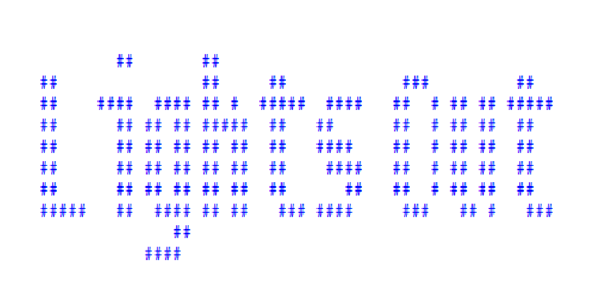
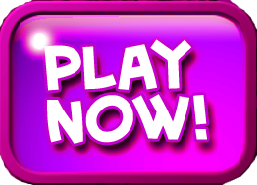

	

----------

The game consists of a 5 by 5 grid of lights. When the game starts, a random number or a stored pattern of these lights is switched on. Pressing any of the lights will toggle it and the four adjacent lights. The goal of the puzzle is to switch all the lights off, preferably in as few button presses as possible. If a light is on, it must be toggled an odd number of times to be turned off. If a light is off, it must be toggled an even number of times (including none at all) for it to remain off. Several conclusions are used for the game's strategy. Firstly, the order in which the lights are pressed does not matter, as the result will be the same. Secondly, in a minimal solution, each light needs to be pressed no more than once, because pressing a light twice is equivalent to not pressing it at all.

  

   Simple Game Just For Fun :bowtie::see_no_evil:

			

## Contributors

- [Sepand Haghighi](https://github.com/sepandhaghighi "Sepand Haghighi")
- [Ali Gholami](https://github.com/hexpheus "Ali Gholami")

## Dependencies

### Code

- [SweetAlert](https://sweetalert.js.org/ "SweetAlert")
- [Particles.js](https://github.com/VincentGarreau/particles.js/ "Particles.js")
- [Font-Awesome Icon Set](http://fontawesome.io/ "Font-Awesome Icon Set")
- [AddThis](http://www.addthis.com "AddThis")
- [Shortcut.js](http://openjs.com/scripts/events/keyboard_shortcuts/ "Shortcut.js")
- [GoNative](https://gonative.io/ "https://gonative.io/")

### Music
- Track-1 : A New Beginning - [Bensound.com](https://www.bensound.com/bensound-music/bensound-anewbeginning.mp3)

- Track-2 : Happiness - [Bensound.com](https://www.bensound.com/bensound-music/bensound-happiness.mp3)

- Track-3 : Buddy - [Bensound.com](https://www.bensound.com/bensound-music/bensound-buddy.mp3)

- Track-4 : Cute - [Bensound.com](https://www.bensound.com/bensound-music/bensound-cute.mp3)

- Track-5 : Tenderness - [Bensound.com](https://www.bensound.com/bensound-music/bensound-tenderness.mp3)

## Contributing

Changes and improvements are more than welcome! Feel free to fork and open a pull request. Please make your changes in a specific branch and request to pull into `master`! If you can, please make sure the game fully works before sending the PR, as that will help speed up the process.

## Issues & Bug Reports			

Just fill an issue and describe it. We'll check it ASAP!

## Donations

If you do like our game and we hope that you do, can you please support us? Our game is not and is never going to be working for profit. We need the money just so we can continue doing what we do ;-) .			

				

